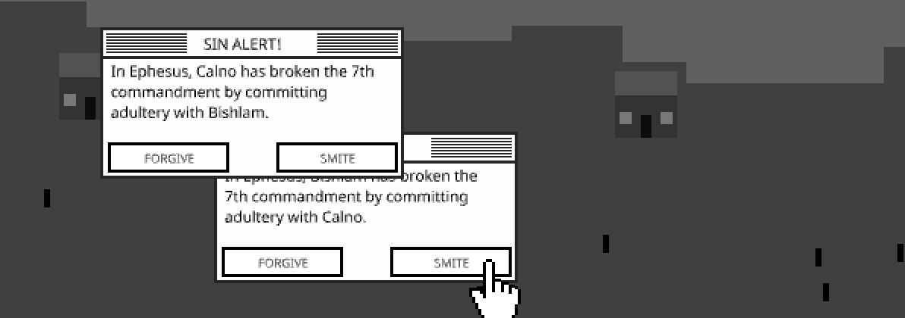

# Let There Be Smite

## [Play Online](https://pippinbarr.com/let-there-be-smite/) (desktop browser, flash emulation with [ruffle](https://ruffle.rs))

## Description

*A God-game from another mother! Whatever that means! Take on the Big Job and decide whether to punish or forgive all the Sinners in the world! If you get sick of them, just flood the planet!*

Let There Be Smite! was written in ActionScript 3 using Adobe's FlashBuilder 4.0 and the excellent [Flixel](http://flixel.org/) library. It uses free sound files from the internet provided by people who didn't ask for attribution and aren't getting any! The game is now being presented in emulation thanks to [ruffle](https://ruffle.rs).

## Press

* [Gamers With Jobs](http://www.gamerswithjobs.com/node/109017)
* [Trinn](http://trinn.webs.com/june2011.htm)
* [Unwinnable](http://www.unwinnable.com/2011/09/13/pippin-barr-break/)
* [O'Reilly Radar](http://radar.oreilly.com/2011/07/four-short-links-4-july-2011.html).

## Documentation

* Read the [Process documentation](../process)
* Look at the [code repository](https://github.com/pippinbarr/let-there-be-smite) for source code, the original .swf file etc.

## License

*Let There Be Smite* is an open source game licensed under a [Creative Commons Attribution-NonCommercial 3.0 Unported License](http://creativecommons.org/licenses/by-nc/3.0/). You can obtain the source code from its [code repository](https://github.com/pippinbarr/let-there-be-smite).
